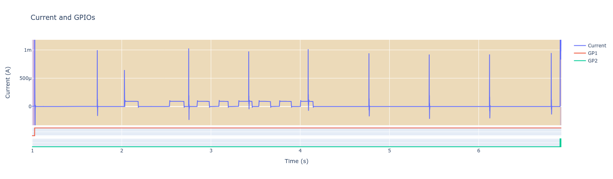

.. _ti-cc13x2_cc26x2-sensor-controller-sample:

cc13x2_cc26x2 Sensor Controller Sample
#################################################

Overview
********

This sample demonstrates the use of the Sensor Controller on the CC13x2/CC26x2
LaunchPad. It is an extension of the cc13x2_cc26x2/system_off board specific
sample.
It first runs through a sequence of busy-waiting, sleeping and standby and then
starts the Sensor Controller task. This task waits for a button press on BTN-1
After the button press, the user has five seconds to press BTN-2 at least five
times. If at least five presses are detected, the Sensor Controller task will
generate an alert event and wake up the main CPU. The main CPU will then print
the number of button presses and shut down the system.

Requirements
************

This application uses the CC13x2/CC26x2 LaunchPad for the demo.

Building, Flashing and Running
******************************

.. zephyr-app-commands::
   :zephyr-app: samples/boards/ti/cc13x2_cc26x2/sensor_controller
   :board: cc1352r1_launchxl
   :goals: build flash
   :compact:

After flashing the device, run the code:

1. Unplug the USB cable from the LaunchPad and reconnect it to fully
   power-cycle it.
2. Open UART terminal.
3. Hit the Reset button on the LaunchPad.
4. Device will turn off the external flash, which is on by default, to
   reduce power consumption.
5. Device will demonstrate active, idle and standby modes.
6. Device will then start the Sensor Controller task and put the main CPU
   to sleep.
7. Press BTN-1 to wake up the Sensor Controller and start a ~5 second timer and
   pulse counter on BTN-2.
8. Press BTN-2 at least five times within five seconds.
9. The device will then wake up and print the number of button presses and also
   output the number as pulses on the GPIO connected to the red LED.

Sample Output
=================

cc1352rl_launchxl output
------------------------

.. code-block:: console

        *** Booting Zephyr OS build zephyr-v2.2.0-664-gd774727cc66e  ***
        Initializing
        SCIF driver callback: Task control interface ready
        Shutting down external flash

        Busy-wait 500 ms
        Sleep 3 ms (IDLE)
        Sleep 500 ms (STANDBY)

        Starting Sensor Controller task and going to sleep
        Press button 1 to wake up and then button 2 at least 5 times.

        SCIF driver callback: Task control interface ready
        Button press count: 7
        Shutting down

Current as measured with an Qoitech Otii Arc:
---------------------------------------------

Zoomed in on the current during startup until the start of the Sensor Controller
task:

Zoomed in on the current during the Sensor Controller task:
